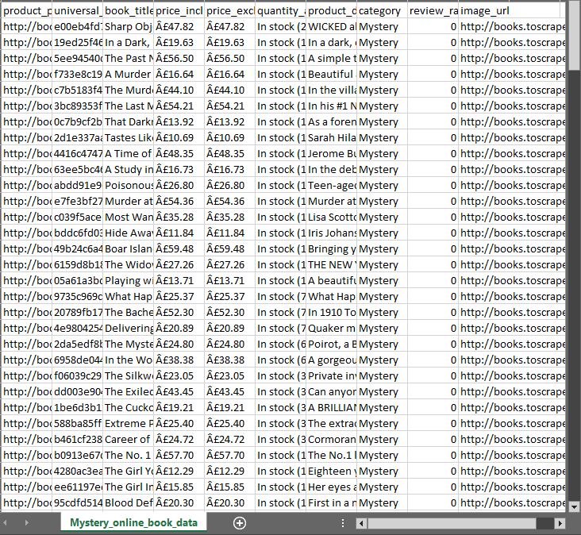
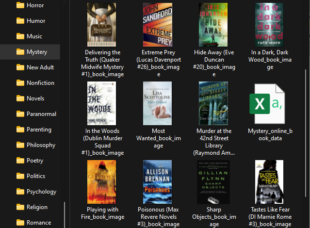

# OpenclassroomsProject:  Books to Scrape

## **Description**
#### Project to create Books Online price monitoring system to extract book data on Books to Scrape: http://books.toscrape.com/.
#### The following book details extraction required: product_page_url, universal_ product_code (upc), book_title, price_including_tax, price_excluding_tax, quantity_available, product_description, category, review_rating, and image_url.

## **How to run code?**
### ● Create a directory as your local repository (e.g., Books_Online_Project)
### ● Create a code file (e.g., BooksOnlineCode.py)

### ● Create a virtual Environment by:
  _Python3 – m venv env_

### ● Activate the virtual environment
_env\Scripts\activate.bat (windows),
env/bin/activate (MacOS)_

### ● Install Python library:
_pip install requests, pip install BeautifulSoup_

### ● Install packages:
- import requests
- from bs4 import BeautifulSoup
- import csv
- import os.path
- import shutil

### ● copy code to your environment from https://github.com/olando1939/OpenclassroomsProject.git: 
##### Run the main function of code to extract, transform, and load:
- All categories on Books to Scrape
- Books in each category
- save to CSV file Book details including the price of each category’s books_
##### ******

- download and save book images
##### ******
 

